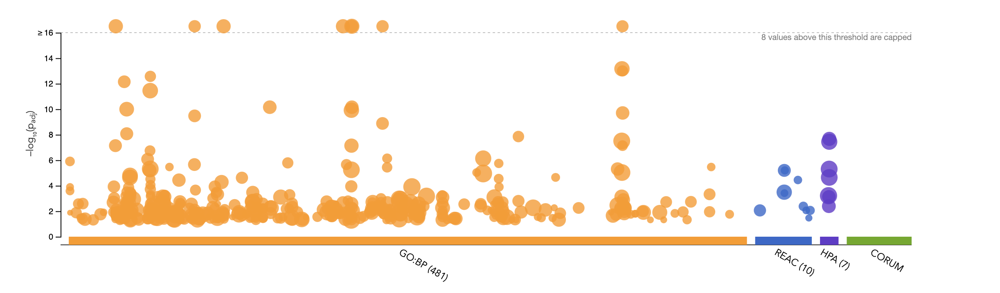

## Introduction
(This file is called "A2_bcb420.Rmd" in my docker file, wasn't able to rename. It's uploaded with the proper naming on Github, hope that's alright.)

Continuing from A1, the data source used for this analysis is: [GSE135448](https://www.ncbi.nlm.nih.gov/geo/query/acc.cgi?acc=GSE135448)

The data chosen is from a research study on how high-protein (HP) and low-protein(LP) diet were more effective in reducing liver fat and reversing NAFLD. In the study, they took 19 participants who were undergoing bariatric surgery for obesity, and gave them HP or LP diets and then analyzed the metabolic pathways changes.

Here's a figure from the research paper, we see expression level of genes involved in the regulation of liver fat accumulation. These graphs show some of the results the research paper found. 


We load and set up the data from last time.

```{r, warning=FALSE, message=FALSE, results='hide'}
#Install necessary packages if not already

if (!requireNamespace("BiocManager", quietly = TRUE)){ 
  install.packages("BiocManager")
  BiocManager::install("edgeR")
  BiocManager::install("biomaRt") 
}
if (! requireNamespace("edgeR", quietly = TRUE)) {
  BiocManager::install("edgeR")
}
if (! requireNamespace("circlize", quietly = TRUE)) {
  install.packages("circlize")
}
if (! requireNamespace("ComplexHeatmap", quietly = TRUE)) {
  install.packages("ComplexHeatmap")
}
if (! requireNamespace("limma", quietly = TRUE)) {
  install.packages("limma")
}

library(edgeR)
library(limma)
library(BiocManager)
library(biomaRt)
library(ComplexHeatmap)
library(circlize)
library(dplyr)


#Load data from A1 
#These files are also on github/docker
normData <- readRDS("GSE135448_normalized_counts.RDS")
filterData <- readRDS("GSE135448_filtered.RDS")

filterMatrix <- as.matrix(filterData[,2:20])
rownames(filterMatrix) <- filterData$genesymbol

#LP = low protein diets
#HP = high protein diets
samples <- data.frame(
  samples = colnames(normData)[1:19],
  diettype = rep(c("HP", "LP", "LP"), each = 9, length.out = 19)
)

```


## Differential Expression Analysis

First let's try visualizing the normalized data with a heatmap.
```{r, warning=FALSE, message=FALSE, out.width=c('50%', '50%'), fig.align='center', fig.show='hold', fig.cap="Figure 2: First try of Heatmap before DEA"}
# Heatmap: First try
heatmap_matrix <- normData[, 1:ncol(normData)]
rownames(heatmap_matrix) <- rownames(normData)
colnames(heatmap_matrix) <- colnames(normData[,1:ncol(normData)])
heatmap_matrix <- t(scale(t(heatmap_matrix)))

if(min(heatmap_matrix) == 0){
  heatmap_col = colorRamp2(c( 0, max(heatmap_matrix)), c( "white", "red"))
} else {
  heatmap_col = colorRamp2(c(min(heatmap_matrix), 0, max(heatmap_matrix)), c("blue", "white", "red"))
}
heatmapRow <- Heatmap(as.matrix(heatmap_matrix),
      show_row_dend = TRUE,
      show_column_dend = TRUE, 
      col=heatmap_col,
      show_column_names = TRUE, 
      show_row_names = FALSE,
      show_heatmap_legend = TRUE, 
      row_title = "Genes")

heatmapRow

```

Recall the MDS plot. We noticed that the HP diets are more grouped by cluters.
```{r, warning=FALSE, message=FALSE, out.width=c('50%', '50%'), fig.align='center', fig.show='hold', fig.cap="Figure 3: MDS plot"}

# MDS plot by diet types for each sample
colour <- unlist(rainbow(2))[factor(samples$diettype)] # we have red = HP, cyan = LP
plotMDS(heatmap_matrix, 
        col = colour,
        main = "MDS plot: Patient diet type model")
legend("topright", 
       legend=c("HP diet", "LP diet"),
       fill = colour,
       cex=0.7)

```

In lecture, we went over 2 different methods: using edgeR or limma. After some research I decided to go with edgeR. 

```{r, warning=FALSE, message=FALSE}
#Calculate dispersion from counts for model
d = edgeR::DGEList(counts=filterMatrix, group=samples$diettype)

model_design <- model.matrix(~0 + samples$diettype)

d <- edgeR::estimateDisp(d, model_design)
d <- calcNormFactors(d)
fit <- edgeR::glmQLFit(d, model_design)

#View the model
knitr::kable(model_design[1:19,1:2], type="html") 

```

There isn't exactly a "control" group here. The experiment is based on the comparison between LP and HP diets. The regular diet(RP) is not given. The researchers wanted to see which diet would be better for reducing liver fat and reversing NAFLD mechanisms. So unlike the lectures, for calculations, I'm comparing groups using contrast. 

```{r, warning=FALSE, message=FALSE}
#Use Quasi liklihood model for differential expression
LPvsHP <- glmQLFTest(fit, contrast=c(-1, 1))
HPvsLP <- glmQLFTest(fit, contrast=c(1, -1))
#Tried both contrasts, LPvsHP results are more similar to the authors' result from the research paper 
knitr::kable(topTags(LPvsHP), type="html",row.names = FALSE)
knitr::kable(topTags(HPvsLP), type="html",row.names = FALSE)

#Get results & sort by p-value
output_hits <- topTags(LPvsHP, sort.by = "PValue", n = nrow(normData))

#Check for genes with p-value < 0.05
length(which(output_hits$table$PValue < 0.05))

#We are using BH correction because topTags it by default
#Check for genes that pass correction
length(which(output_hits$table$FDR < 0.1))

results <- output_hits$table
```

Let's redo the heatmap with the top hits gotten from edgeR method. 
```{r, warning=FALSE, message=FALSE, fig.show='hold', fig.cap="Figure 4: Heatmap of normalized sample data gotten from edgeR"}
# Heatmap: (re-try) top hits

top_hits <- rownames(output_hits$table)[results$PValue<0.05]

heatmap_matrix_tophits <- t(
  scale(t(heatmap_matrix[which(rownames(heatmap_matrix) %in% top_hits),])))

if(min(heatmap_matrix_tophits) == 0){
  heatmap_col = colorRamp2(c( 0, max(heatmap_matrix_tophits)), 
                             c( "white", "red"))
} else {
  heatmap_col = colorRamp2(c(min(heatmap_matrix_tophits), 0, 
                    max(heatmap_matrix_tophits)), 
                    c("blue", "white", "red"))
}

heatmapCol <- Heatmap(as.matrix(heatmap_matrix_tophits),
                           cluster_rows = TRUE,
                           cluster_columns = TRUE,
                               show_row_dend = TRUE,
                               show_column_dend = TRUE, 
                               col=heatmap_col,
                               show_column_names = TRUE, 
                               show_row_names = FALSE,
                               show_heatmap_legend = TRUE,
                               column_title = "Samples grouped by diet types", 
                               row_title = "Genes",
                               )
heatmapCol
```

## Results for DE
1. Calculate p-values for each of the genes in your expression set. How many genes were significantly differentially expressed? What thresholds did you use and why?
* The threshold used was 0.05 because it's commonly used for statistical null-hypothesis significance testing. 
* For edgeR, it was shown above, that there were 1687 DEGs with the threshold of 0.05.

2. Multiple hypothesis testing - correct your p-values using a multiple hypothesis correction method. Which method did you use? And Why? How many genes passed correction?
* For this, I used Benjamini-Hochberg (BH) method to correct p-value because it's a common method in multiple hypothesis testing.
* for edgeR, 0 passed correction.

3. Show the amount of differentially expressed genes using an MA Plot or a Volcano plot. Highlight genes of interest.
* I used a MA plot. The genes of interest were picked based on what was seen as significant in the research paper.

4. Visualize your top hits using a heatmap. Do you conditions cluster together? Explain why or why not.
* For top hits gotten using edgeR, its clusters aren't clearly divided. 
* We see that the upregulated clusters are more weighted for in LP group and the downregulated clusters are more weighted for HP group.


## Thresholded Over-representation analysis

```{r, warning=FALSE, message=FALSE}
#Sort them by their ranks: using logFC and -log p-value
newResults <- results
newResults$rank <- -log10(results$PValue) * sign(results$logFC)
newResults <- newResults[order(newResults$rank, decreasing = TRUE), ]

#Upregulated and downregulated genes

upregulated <- rownames(newResults)[which(newResults$PValue < 0.05           
             & newResults$logFC > 0)]

downregulated <- rownames(newResults)[which(newResults$PValue < 0.05          
             & newResults$logFC < 0)] 

#Significant differentially expressed genes
allSig <- rownames(newResults)[which(newResults$PValue < 0.05)]


#Save files for next assignment
write.table(x = upregulated,            
            file = ("upregulated_genes.txt"), 
            sep ="\t", row.names = FALSE,col.names = FALSE, quote = FALSE)
write.table(x = downregulated,            
            file= ("downregulated_genes.txt"), 
            sep ="\t", row.names = FALSE,col.names = FALSE, quote = FALSE)
write.table(x = allSig,            
            file= ("all_DE_genes.txt"), 
            sep ="\t", row.names = FALSE,col.names = FALSE, quote = FALSE)
saveRDS(newResults, file="ranked_genes.RDS")

```

From the MA plot, we can clearly see the separation between upregulated and downregulated genes. 
```{r, warning=FALSE, message=FALSE, fig.cap="Figure 5: MA plot"}
#MA plot

newResults$colour <- "grey"
newResults$colour[which(newResults$PValue < 0.05 & newResults$logFC > 0)] <- "red"
newResults$colour[which(newResults$PValue < 0.05 & newResults$logFC < 0)] <- "blue"
 
plot(newResults$logCPM, newResults$logFC, main = "MA plot for DE", 
     xlab = "logCPM", ylab = "logFC", col=newResults$colour)

legend("topright", 
       legend=c("upregulated", "downregulated", "neither"), 
       fill = c("blue","red", "grey"))

#Let's pick a gene of interest
#Based on the paper, we see significant difference in FASN exp between LP and HP,
#but we see similar in IRS1 exp between LP and HP. 
gene_of_interest <- list("IRS1","FASN")
cols <- rainbow(length(gene_of_interest))

for (i in 1:length(gene_of_interest)){
  points(results[which(rownames(results) == gene_of_interest[i]),2:1], col=cols[i], pch=17)
}

```


## Results for threshold ORA
1. Which method did you choose and why?
* I chose the edgeR results because it is designed for RNA Seq.

2. What annotation data did you use and why? What version of the annotation are you using?
* I used g:profiler since we learned about it in class and I had practice working with it.

3. How many genesets were returned with what thresholds?
* I selected a threshold of 0.05 with Benjamini-Hochberg correction, GO biological process (to get a general overview of gene functional clusters). I didn't select for KEGG/Wikipathway as it gave disease characteritics that I didn't think was relevant. I also checked the protein databases as they are relevant in this case.
* Up-regulated: returned 904 different genes for GO, 74 for Reactome, 401 for Human Protein Atlas and 4 for CORUM.

* Down-regulated: returned 481 different genes for GO, 10 for Reactome, and 7 for Human Protein Atlas.


4. Run the analysis using the up-regulated set of genes, and the down-regulated set of genes separately. How do these results compare to using the whole list?
* Down-regulated (Source | Top results | T | Q | T∩Q):
     * GO | Small molecule metabolic process | 1779 | 543 | 129 
     * Reactome | Metabolism of amino acids and derivatives | 370 | 350 | 35
     * Human Protein Atlas | Liver, hepatocytes | 858 | 859 | 66
     
* Up-regulated (Source | Top results | T | Q | T∩Q):
     * GO | positive regulation of biological process | 6094 | 825 | 364
     * Reactome | Immune System | 2041 | 589 | 174
     * Human Protein Atlas | Lung | 7343 | 609 | 506

* All DE genes (Source | Top results | T | Q | T∩Q):
     * GO | Small molecule metabolic process | 1779 | 1368 | 230
     * Reactome | Metabolism | 2075 | 939 | 231
     * Human Protein Atlas | Kidney | 8200 | 986 | 821
     
     
## Interpretation
1. Overall yes it does, as from the research paper (referenced below) that some genes, such as COL type genes and LPL (those mostly involved in lipid storage and triglyceride hydrolysis) were upregulated. This was shown in our results as well. However, the paper specifically mentioned that these genes were more upregulated in the LP group than the HP group. But this comparison between the HP and LP groups cannot be clearly identified with our results. I tried to separate the upregulated/downregulated results for HP and LP groups, however because there is no control (regular diet group), I couldn't get separate results. This makes it difficult to evaluate and clearly compare the upregulated/downregulated results per diet groups. 

2. From the original research paper (https://onlinelibrary.wiley.com/doi/10.1111/liv.14596) we see this. Also in other research papers(Refer to reference 2 and 3), it can be confirmed that LPL (and involved/related genes) is upregulated in these diet conditions.


## Links to Github journal
* [Journal for A2](https://github.com/bcb420-2022/Jerrie_Feng/wiki/Assignment-2)
* [Links to A1 related files - these were sourced at the beginning](https://github.com/bcb420-2022/Jerrie_Feng)


## References
1. Xu C, Markova M, Seebeck N, Loft A, Hornemann S, Gantert T, Kabisch S, Herz K, Loske J, Ost M, Coleman V, Klauschen F, Rosenthal A, Lange V, Machann J, Klaus S, Grune T, Herzig S, Pivovarova-Ramich O, Pfeiffer AFH. High-protein diet more effectively reduces hepatic fat than low-protein diet despite lower autophagy and FGF21 levels. Liver Int. 2020 Dec;40(12):2982-2997. doi: 10.1111/liv.14596. Epub 2020 Jul 21. PMID: 32652799.

2. Bharanidharan R, Thirugnanasambantham K. Ibidhi R, Bang G, Jang SS, Baek YC, Kim KH, Moon Y. Effects of Dietary Protein Concentration on Lipid Metabolism Gene Expression and Fatty Acid Composition in 18–23-Month-Old Hanwoo Steers. Animals 2021, 11, 3378. https://doi.org/10.3390/ani11123378. 

3. Boualga A, Bouchenak M, Belleville J. Low-protein diet prevents tissue lipoprotein lipase activity increase in growing rats. British Journal of Nutrition. 2000; 84(5), 663-671. doi:10.1017/S0007114500002002.

4. Ramos M, Morgan M. BiocManager. 2021. https://cran.r-project.org/web/packages/BiocManager/index.html. 

5. Gu Z, Eils R, Schlesner M (2016). “Complex heatmaps reveal patterns and correlations in multidimensional genomic data.” Bioinformatics. https://jokergoo.github.io/ComplexHeatmap-reference/book/. 

6. Robinson MD, McCarthy DJ, Smyth GK. “edgeR: a Bioconductor package for differential expression analysis of digital gene expression data.” Bioinformatics, 26(1), 139-140. 2020. doi: 10.1093/bioinformatics/btp616.