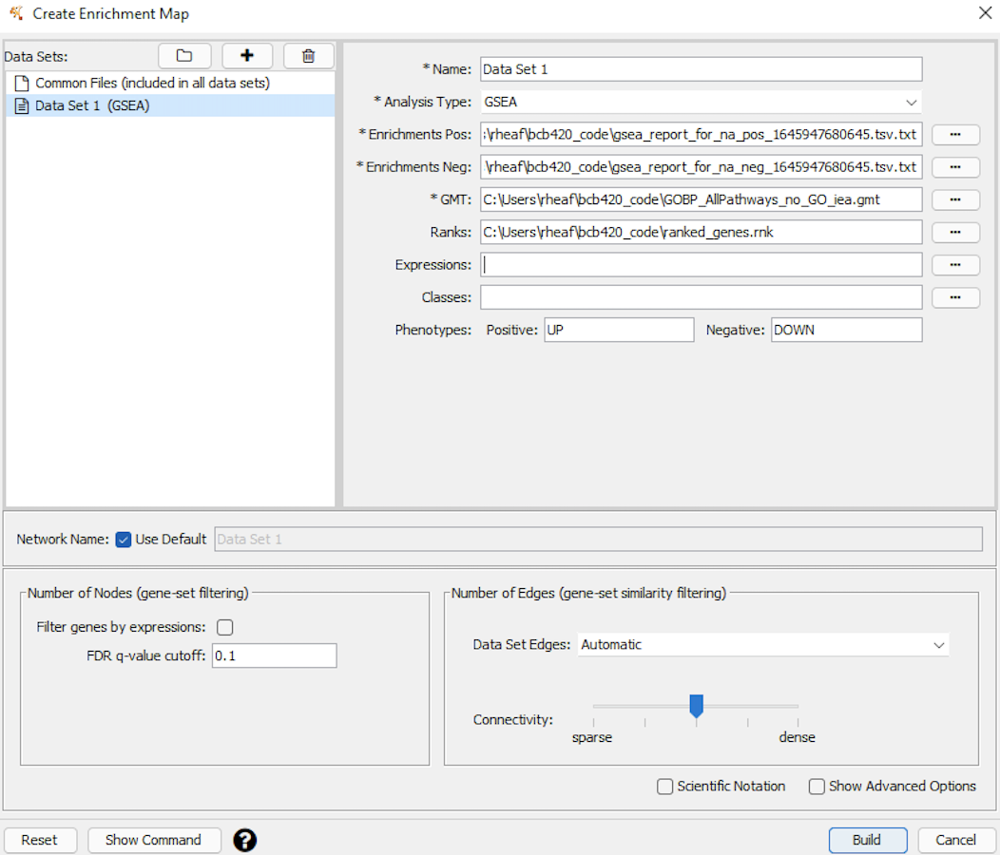

<br>

# Introduction
(This file is called "A3_bcb420.Rmd" in my docker file, I couldn't rename it. It's uploaded with the proper naming on Github, hope that's alright.)

The dataset chosen is GSE135448, and it explores whether low protein(LP) or highprotein(HP) diets are more effective in reducing liver fat and reversing NAFLD. The data contains 19 samples in which half are LP samples and the other half are HP samples.

```{r, warning=FALSE, message=FALSE}
#Install packages if needed

if (!requireNamespace("BiocManager", quietly = TRUE)){
  install.packages("RCurl")
  BiocManager::install("edgeR")
}
if (!requireNamespace("GEOmetadb", quietly = TRUE)) {
  BiocManager::install("GEOmetadb")
}  
if (! requireNamespace("circlize", quietly = TRUE)) {
  install.packages("circlize")
}
if (! requireNamespace("ComplexHeatmap", quietly = TRUE)) {
  install.packages("ComplexHeatmap")
}
if (!require("kableExtra", quietly = TRUE)){
  install.packages("kableExtra")
}
  
library(GEOmetadb)
library(knitr)
library(edgeR)
library(ComplexHeatmap) 
library(circlize)
library(RCurl)
library(dplyr)
library(kableExtra)

```


### Brief Intro for Assignment 1
In assignment 1, the data was cleaned by removing duplicates and low expressed values. It was then normalized and mapped to HUGO symbols. The cleaned data was saved into _GSE135448_normalized_counts.RDS_ file. For more details, refer to _A1_BCB420.Rmd_ file on Github.

```{r, message=FALSE, warning=FALSE, out.width=c('50%', '50%'), fig.show='hold', fig.cap="Figure 1: Normalization Density Plot", fig.align='center'}

# Get the filtered data from A1
if (!file.exists("GSE135448_filtered.RDS")) {
  options(knitr.duplicate.label = 'allow')
  source(purl("A1_BCB420.Rmd", output = tempfile()))
}
filterData <- readRDS("GSE135448_filtered.RDS")

# Group according to experiment conditions - sort into 2 diets
samples <- data.frame(
  samples = colnames(filterData)[2:20],
  diettype = rep(c("HP", "LP", "LP"), each = 9, length.out = 19)
)

# Performed normalization 
matrix <- as.matrix(filterData[,2:20])
rownames(matrix) <- filterData$genesymbol
dValue <- edgeR::DGEList(counts=matrix, group=samples$diettype)
#Get normalization factors
dValue <- edgeR::calcNormFactors(dValue)
normData <- edgeR::cpm(dValue)

# Pre-normalization
pre_density <- apply(log2(edgeR::cpm(filterData[2:20])), 2, density)
xlim <- 0
ylim <- 0
for (i in 1:length(pre_density)) {
  xlim <- range(c(xlim, pre_density[[i]]$x))
  ylim <- range(c(ylim, pre_density[[i]]$y))
}
cols <- cm.colors(length(pre_density))
ltys <- rep(1, length(pre_density))
    
plot(pre_density[[1]], xlim=xlim, ylim=ylim, ylab="density", xlab = "log2 CPM", type="n", cex.lab = 0.8, main="Figure 1: Pre-normalization")

for (i in 1:length(pre_density)){
  lines(pre_density[[i]], col=cols[i])
}
legend("topright", colnames(filterData[2:20]),  
           col=cols, lty=ltys, cex=0.75, 
           border ="blue",  text.col = "green4", 
           merge = TRUE, bg = "gray90") 


# After normalization
density <- apply(log2(normData), 2, density)
xlim <- 0
ylim <- 0
for (i in 1:length(density)) {
  xlim <- range(c(xlim, density[[i]]$x))
  ylim <- range(c(ylim, density[[i]]$y))
}
cols <- cm.colors(length(density))
ltys <- rep(1, length(density))
 
plot(density[[1]], xlim=xlim, ylim=ylim, ylab="density", xlab = "log2 CPM", main="Figure 1.2: After normalization")

for (i in 1:length(density)){
  lines(density[[i]], col=cols[i])
}
legend("topright", colnames(filterData[2:20]),  
           col=cols, lty=ltys, cex=0.75, 
           border ="blue",  text.col = "green4", 
           merge = TRUE, bg = "gray90") 


# Final normalized data results saved
if (!file.exists("GSE135448_normalized_counts.RDS")) {
  saveRDS(normData, "GSE135448_normalized_counts.RDS")
}

```
<br>

### Brief Intro for Assignment 2

In assignment 2, differential expression analysis and thresholded over-representation analysis was conducted with the normalized data from A1. 
```{r, message=FALSE, warning=FALSE, out.width=c('50%', '50%'), fig.show='hold', fig.align='center'}

# Differential Gene Expression Analysis
normData <- readRDS("GSE135448_normalized_counts.RDS")

heatmap_matrix <- normData[, 1:ncol(normData)]
rownames(heatmap_matrix) <- rownames(normData)
colnames(heatmap_matrix) <- colnames(normData[,1:ncol(normData)])
heatmap_matrix <- t(scale(t(heatmap_matrix)))

# MDS plot by diet types for each sample
colour <- unlist(rainbow(2))[factor(samples$diettype)] # we have red = HP, cyan = LP
plotMDS(heatmap_matrix, 
        col = colour,
        main = "Figure 2: MDS plot - Patient diet type model")
legend("topright", 
       legend=c("HP diet", "LP diet"),
       fill = colour,
       cex=0.7)


#Calculate dispersion from counts for model
filterMatrix <- as.matrix(filterData[,2:20])
rownames(filterMatrix) <- filterData$genesymbol
d = edgeR::DGEList(counts=filterMatrix, group=samples$diettype)
model_design <- model.matrix(~0 + samples$diettype)

d <- edgeR::estimateDisp(d, model_design)
d <- calcNormFactors(d)
fit <- edgeR::glmQLFit(d, model_design)

#Use Quasi liklihood model for differential expression
LPvsHP <- glmQLFTest(fit, contrast=c(-1, 1))
#Get results & sort by p-value
output_hits <- topTags(LPvsHP, sort.by = "PValue", n = nrow(normData))
results <- output_hits$table


# MA plot
newResults <- results
newResults$colour <- "grey"
newResults$colour[which(newResults$PValue < 0.05 & newResults$logFC > 0)] <- "red"
newResults$colour[which(newResults$PValue < 0.05 & newResults$logFC < 0)] <- "blue"
 
plot(newResults$logCPM, newResults$logFC, main = "Figure 3: MA plot for DE", 
     xlab = "logCPM", ylab = "logFC", col=newResults$colour)

legend("topright", 
       legend=c("upregulated", "downregulated", "neither"), 
       fill = c("blue","red", "grey"))

#Let's pick a gene of interest
#Based on the paper, we see significant difference in FASN exp between LP and HP,
#but we see similar in IRS1 exp between LP and HP. 
gene_of_interest <- list("IRS1","FASN")
cols <- rainbow(length(gene_of_interest))

for (i in 1:length(gene_of_interest)){
  points(results[which(rownames(results) == gene_of_interest[i]),2:1], col=cols[i], pch=17)
}


# Heatmap: top hits
top_hits <- rownames(output_hits$table)[results$PValue<0.05]

heatmap_matrix_tophits <- t(
  scale(t(heatmap_matrix[which(rownames(heatmap_matrix) %in% top_hits),])))

if(min(heatmap_matrix_tophits) == 0){
  heatmap_col = colorRamp2(c( 0, max(heatmap_matrix_tophits)), 
                             c( "white", "red"))
} else {
  heatmap_col = colorRamp2(c(min(heatmap_matrix_tophits), 0, 
                    max(heatmap_matrix_tophits)), 
                    c("blue", "white", "red"))
}

heatmapCol <- Heatmap(as.matrix(heatmap_matrix_tophits),
                           cluster_rows = TRUE,
                           cluster_columns = TRUE,
                               show_row_dend = TRUE,
                               show_column_dend = TRUE, 
                               col=heatmap_col,
                               show_column_names = TRUE, 
                               show_row_names = FALSE,
                               show_heatmap_legend = TRUE,
                               column_title = "Samples grouped by diet types", 
                               row_title = "Genes",
                               name = "Figure 4: Top hits heatmap"
                               )
heatmapCol

```

We can compare this with the first try of Heatmap (pre-Quasi liklihood model):

{width=400px}

<br>

```{r, message=FALSE, warning=FALSE}
# Thresholded over-representation analysis

#Sort them by their ranks: using logFC and -log p-value
newResults <- results
newResults$rank <- -log10(results$PValue) * sign(results$logFC)
newResults <- newResults[order(newResults$rank, decreasing = TRUE), ]

#Upregulated and downregulated genes

upregulated <- rownames(newResults)[which(newResults$PValue < 0.05           
             & newResults$logFC > 0)]

downregulated <- rownames(newResults)[which(newResults$PValue < 0.05          
             & newResults$logFC < 0)] 

#Significant differentially expressed genes
allSig <- rownames(newResults)[which(newResults$PValue < 0.05)]

# Check if already have these files from A2
if(!file.exists("upregulated_genes.txt")){
  write.table(x = upregulated,            
            file = ("upregulated_genes.txt"), 
            sep ="\t", row.names = FALSE,col.names = FALSE, quote = FALSE)
}
if(!file.exists("downregulated_genes.txt")){
  write.table(x = downregulated,            
            file= ("downregulated_genes.txt"), 
            sep ="\t", row.names = FALSE,col.names = FALSE, quote = FALSE)
}
if(!file.exists("ranked_genes.RDS")){
  saveRDS(newResults, file="ranked_genes.RDS")
}

```

By using g:profiler, threshold analysis was performed on the upregulated and downregulated gene lists.

 * Down-regulated (Source | Top results | T | Q | T∩Q):
     * GO | Small molecule metabolic process | 1779 | 543 | 129 
     * Reactome | Metabolism of amino acids and derivatives | 370 | 350 | 35
     * Human Protein Atlas | Liver, hepatocytes | 858 | 859 | 66
     
 * Up-regulated (Source | Top results | T | Q | T∩Q):
     * GO | positive regulation of biological process | 6094 | 825 | 364
     * Reactome | Immune System | 2041 | 589 | 174
     * Human Protein Atlas | Lung | 7343 | 609 | 506

 * All DE genes (Source | Top results | T | Q | T∩Q):
     * GO | Small molecule metabolic process | 1779 | 1368 | 230
     * Reactome | Metabolism | 2075 | 939 | 231
     * Human Protein Atlas | Kidney | 8200 | 986 | 821
   

Overall, our analysis show that there are reductions in IHL in the HP group, and not much change in LP group. This can be seen through the gene expression levels in where inflammatory genes, lipid biosynthesis...etc (ex: LPL, IRS1...etc) were significantly higher in LP group.

<br>
<br>

# Non-thresholded Gene set Enrichment Analysis

After cleaning and normalizing the data, we got the p-values showing which were over or under expressed. The threshold for significance was p-value<0.05. 
We got 733 genes downregulated and 953 upregulated. 

To perform the non-thresholded gene set enrichment analysis, we need the ranked gene list based on what we had in Assignment 2. 
```{r, message=FALSE, warning=FALSE}
#Load file from A2
ranked <- readRDS("ranked_genes.RDS")

#Get file ready for GSEA
rankedGenes <- data.frame(gene = rownames(ranked), rank = ranked$rank)
rankedGenes <- rankedGenes[order(rankedGenes$rank, decreasing = TRUE), ]

#Save as rnk file for using in GSEA
write.table(rankedGenes, file = "ranked_genes.rnk", row.names = FALSE, col.names = TRUE, quote = FALSE, sep = "\t")


# Geneset source
#Using from Bader Lab
gmt_url <- "http://download.baderlab.org/EM_Genesets/current_release/Human/symbol/"

filenames <- RCurl::getURL(gmt_url)
textCon <- textConnection(filenames)
contents <- readLines(textCon)
close(textCon)

#gmt with all pathways but without IEA
rx <- gregexpr("(?<=<a href=\")(.*.GOBP_AllPathways_no_GO_iea.*.)(.gmt)(?=\">)",
               contents, perl = TRUE)
gmt_filename <- unlist(regmatches(contents, rx))

download.file(paste(gmt_url, gmt_filename, sep = ""), destfile = "GOBP_AllPathways_no_GO_iea.gmt")

```

### 1. What method did you use? What genesets did you use? Make sure to specify versions and cite your methods.

We take the ranked gene list and run it through GSEA GUI (using v4.2.2). The geneset data that was used is the latest version of human symbol gotten from Bader Lab. Refer to the code above for how it was gotten: _GOBP_AllPathways_no_GO_iea.gmt_ . The r package `RCurl` was used to query and applied to get the latest file. 

Used parameters of: 

 * 1000 permutations
 * no collapse of gene symbol
 * weighted Enrichrim statistic
 * size (15 - 200)

Parameters:

{width=500px}

### 2. Summarize your enrichment results.

From the results, we see there are 5062 / 13434 genes passed. 
3888 are upregulated and 1174 are downregulated. 

 * Of the upregulated, 1676 genes passed threshold at FDR < 25% and 1250 are significantly enriched with p-value < 0.05.
 * Of the downregulated, 151 genes passed threshold at FDR < 25% and 186 are significantly enriched with p-value < 0.05.


{width=500px}

{width=500px}

{width=500px}

We see that the top geneset returned are:
```{r results='asis', echo=FALSE, message=FALSE, warning=FALSE}

labelz = c("Phenotype","Top geneset","Size", "ES", "NES", "p-value", "FDR","Top-gene")
type = c("na_pos", "na_neg")
geneset = c("Hallmark Allograft Rejection", "Stress Response to Metal Ion")
size =c(120, 15)
es = c(0.63, -0.85)
nes = c(2.40, -2.26)
pval = c(0.000, 0.000)
fdr = c(0.000, 0.003)
top_gene = c("CCL11", "ABCF1")

kable(data.frame(type, geneset, size, es, nes, pval, fdr, top_gene), 
      format = 'html', 
      caption="Table 1: GSEA results top geneset", 
      col.names = labelz, escape=FALSE, align="cccccccc")%>%kable_styling(full_width = F) %>% column_spec(column = 2, width = "40%")
```

<br>

### 3. How do these results compare to the results from the thresholded analysis in Assignment 2. Compare qualitatively. Is this a straight forward comparison? Why or why not?

Compared to A2, the results gotten in A3 are different.

We see that in A2, the top results for upregulated is "positive regulation of biological process" for GO:BP, "Immune system" for Reactome, and "Arp2/3 protein complex" for Corum. In A3, we have "Hallmark Allograft Rejection" - however, it can be said that this falls under the general category of "Immune system" (from A2).

For the downregulated, it is "small molecule metabolic process" for GO:BP, "Metabolism of amino acids and derivatives" for Reactome and "liver; hepatocytes" for HPA. However similar to the upregulated results, the results from threshold analysis are general enough that the results from A3 can be categorized under the results from A2.

<br>
<br>

# Visualize in Cytoscape

I'm using Cytoscape 3.9.1. I set the node cutoff for p-value at 0.05, FDR Q-value at 0.05 and similarity at 0.5. I downloaded the enrichment results from before to use.

### 1. Create an enrichment map - how many nodes and how many edges in the resulting map? What thresholds were used to create this map? Make sure to record all thresholds. Include a screenshot of your network prior to manual layout.

There are 968 nodes and 7117 edges in the resulting map according to the edge table and node table. 

### 2. Annotate your network - what parameters did you use to annotate the network. If you are using the default parameters make sure to list them as well.

{width=500px}

### 3. Make a publication ready figure - include this figure with proper legends in your notebook.
Then I used AutoAnnotate app for the annotated network, and used the default parameter as shown in the image. 

{width=500px}

{width=500px}

{width=500px}

### 4. Collapse your network to a theme network. What are the major themes present in this analysis? Do they fit with the model? Are there any novel pathways or themes?

We see that the main cluster with 102 nodes is APC proteasome degradation. This aligns with what we're looking at since the paper is looking at the effectivness of protein diets, thus would be mostly looking at complexes invovled around protein breakdown/response.

<br>
<br>

# Interpretation

### 1. Do the enrichment results support conclusions or mechanism discussed in the original paper? How do these results differ from the results you got from Assignment 2 thresholded methods. 

When looking at the enrichment results, we see that the results are similar to what the paper had as well. In the paper, they saw LP group, genes involved in triglyceride hydrolysis (LPL, FABP4, FABP5) were up-regulated compared with HP group glycogen biosynthesis in the liver were enriched in the HP group compared with the LP group. When comparing it to the general groupings seen here, we can see that the specific genes from the paper falls into these categories. 

As mentioned above, the results from A2 thresholded methods gave much more general results. So althought the results from enrichment results don't match the results from A2 directly, it does fall into similar broader categories. 
For example, we see that "immune cytotoxicity immunity" from the enrichment results fall under the "immune system" results in threshold analysis. 

### 2. Can you find evidence, i.e. publications, to support some of the results that you see. How does this evidence support your result?

Yes in the paper where this data originated from (Refer to reference: Xu et al. 2020), it mentions that transcript coding argininosuccinate synthetase (ASS1) was upregulated in HP diet. Differential expression analyses showed that 66 genes were higher and 70 genes were lower expressed in the HP group compared with the LP group

Those involved in glycogen biosynthesis were enriched in the HP group compared with the LP group. Genes involved in triglyceride hydrolysis, inflammation, apoptosis (ex: LPL) were upregulated in LP group more. And these results in the paper aligned with what was seen in the Cytoscape graphs. 

### 3. Choose a specific pathway or theme to investigate in more detail. Why did you choose this pathway or theme? Show the pathway or theme as a gene network or as a pathway diagram. Annotate the network or pathway with your original log fold expression values and p-values to show how it is effected in your model. 

I'm going to look at immune cytotoxicity immunity cluster since it's the cluster that includes the LPL gene in which the paper said was part of the inflammation pathways that were significantly affected. In particular, it was mentioned that these genes in LP group were more upregulated than HP group.   

{width=500px}

I'm using GeneMANIA app and set the network weighting to "GO biological process-based". We see that there are plenty of interactions, I also have to clean it a bit for all the nodes to be legible. The pink lines represents physical interactions, purple lines represents co-expression, and the blue lines represent pathways. There are other line colours but are less visible. 

{width=500px}

We see that this cluster has interactions with APC proteasome degradation and proliferation regulation cell, which aligns with what the paper has mentioned about it being involved in the protein diets' effectiveness. The graph shows interactions (direct and undirect). Highlighted in bright red shows the co-expressions for LPL, and we see that this gene interacts with a variety of others. 

{width=500px}

As there are lots of information and it is somewhat cluttered, I tried to different themes in order to make it look more legible. 

{width=500px}

{width=500px}


<br>

# Links to Github journal
* [Journal for A3](https://github.com/bcb420-2022/Jerrie_Feng/wiki/Journal-6:-Assignment-3)
* [Links to A1/A2 related files - these were sourced at the beginning](https://github.com/bcb420-2022/Jerrie_Feng)

<br>

# References
1. Xu C, Markova M, Seebeck N, Loft A, Hornemann S, Gantert T, Kabisch S, Herz K, Loske J, Ost M, Coleman V, Klauschen F, Rosenthal A, Lange V, Machann J, Klaus S, Grune T, Herzig S, Pivovarova-Ramich O, Pfeiffer AFH. "High-protein diet more effectively reduces hepatic fat than low-protein diet despite lower autophagy and FGF21 levels". Liver Int. 2020 Dec;40(12):2982-2997. (2020). doi: 10.1111/liv.14596. Epub 2020 Jul 21. PMID: 32652799.

2. Subramanian A, Tamayo P, et al. "Gene set enrichment analysis". (2005);PNAS. https://www.pnas.org/content/102/43/15545.  

3. Liberzon A, Subramanian A, Pinchback R, Thorvaldsdóttir H, Tamayo P, Mesirov JP. "Molecular signatures database (MSigDB) 3.0." Bioinformatics, Volume 27, Issue 12, June 2011, Pages 1739–1740. (2011). https://doi.org/10.1093/bioinformatics/btr260.

4. Reimand J, Isserlin R, Voisin V, et al. "Pathway enrichment analysis and visualization of omics data using g:Profiler, GSEA, Cytoscape and EnrichmentMap". Nat Protoc 14, 482–517. (2019). https://cytoscape.org/cytoscape-tutorials/protocols/enrichmentmap-pipeline/#/14.

5. Franz M, Rodriguez H, Lopes C, “GeneMANIA update 2018.” Nucleic acids research vol. 46,W1 (2018): W60-W64. doi:10.1093/nar/gky311.

6. Merico D, Isserlin R, Stueker O, Emili A, Bader GD. "Enrichment map: a network-based method for gene-set enrichment visualization and interpretation". PLoS One. 2010 Nov 15;5(11):e13984. doi: 10.1371/journal.pone.0013984. PMID: 21085593; PMCID: PMC2981572.

7. Morris, J.H., Apeltsin, L., Newman, A.M. et al. "clusterMaker: a multi-algorithm clustering plugin for Cytoscape". BMC Bioinformatics 12, 436 (2011). https://doi.org/10.1186/1471-2105-12-436. 

8. Oesper L, Merico D, Isserlin R, Bader GD. "WordCloud: a Cytoscape plugin to create a visual semantic summary of networks". Source Code Biol Med. (2011) Apr 7;6:7. doi: 10.1186/1751-0473-6-7. PMID: 21473782; PMCID: PMC3083346.

9. Kucera M, Isserlin R, Arkhangorodsky A, Bader GD. "AutoAnnotate: A Cytoscape app for summarizing networks with semantic annotations". F1000Res. 2016;5:1717. (2016). doi:10.12688/f1000research.9090.1. 
